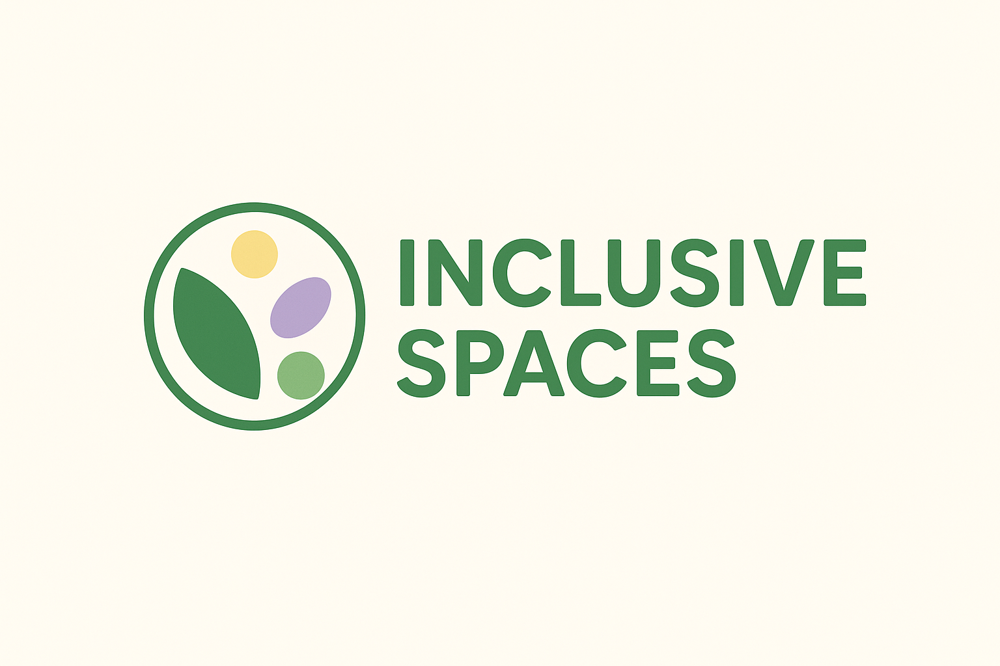

# Overview: Inclusive Spaces
Inclusive Spaces, is a website dedicated to promoting diversity and inclusion. It's purpose is to provide clear, practical information that can be applied in the workplace or educational settings. The site features include helpful images and links, designed to make navigation simple, and ensure users can easily access the information they need.

---

## Table of Contents
1. [Project Overview](#Inclusive Spaces)
2. [Wireframes](#-wireframes)
3. [Use of GitHub Copilot and AI Tools](#-use-of-github-copilot-and-ai-tools)
   - [Branding & Logo Creation](#branding--logo-creation)
   - [Code Corrections & Readability](#code-corrections--readability)
4. [Compatibility Checks](#-compatibility-checks)
5. [Deployment and Version Control](#-deployment-and-version-control)
6. [Tools, Frameworks, and External Resources](#-tools-frameworks-and-external-resources)
   - [Font Awesome](#font-awesome)
   - [Bootstrap](#bootstrap)
   - [Favicon](#favicon)
   - [Additional Resources](#additional-resources)
7. [Validation and Quality Assurance](#-validation-and-quality-assurance)
   - [HTML and CSS Validation](#html-and-css-validation)
   - [Accessibility Checks](#accessibility-checks)
8. [Reflection](#-reflection)

---

## 🧭 Wireframes

Before development, I created **wireframes** to outline the structure and layout of the website.  
This helped plan where each element (navigation, content sections, images, and footer) would be placed and ensured a cohesive flow across the page.

- The wireframes guided the **visual hierarchy**, ensuring the design remained user-friendly and intuitive.
- Accessibility and readability were considered from the start, aligning with UX best practices.

---

## 🤖 Use of GitHub Copilot and AI Tools

AI tools — particularly **GitHub Copilot** and **ChatGPT** — were used strategically throughout the development process to improve workflow and branding consistency.

### **Branding & Logo Creation**
- Copilot provided helpful code suggestions for structuring the site’s **branding section** and integrating a **custom logo**.
- It assisted in refining the placement and alignment of the logo within the navigation bar, maintaining accessibility and visual balance.

### **Code Corrections & Readability**
- AI tools suggested **cleaner code syntax**, helping to correct small errors that affected functionality.
- It also improved **readability and consistency**, ensuring the HTML and CSS followed semantic and accessible coding standards.
- This made the project easier to maintain and validate using standard tools.

---

## 💻 Compatibility Checks

I used **[Am I Responsive?](https://ui.dev/amiresponsive?url=https://rebekah-codes.github.io/The-Inner-Compass-Project/)**  
to verify the website’s responsiveness and appearance across multiple devices.

### **Key Checks**
- Ensured that the layout adapted properly to mobile, tablet, laptop, and desktop screens.
- Verified that all navigation and content sections displayed correctly and consistently.
- Confirmed that there were **no major layout shifts or visibility issues** across devices.

---

## 🧩 Tools, Frameworks, and External Resources

Several tools and resources were used to enhance the design and interactivity of the project:

### **Font Awesome**
- Used for accessible and scalable icons to improve visual clarity.
- Helped emphasise navigation and feature sections without increasing page load size.
https://fontawesome.com/icons
### **Bootstrap**
- Used as a **CSS framework** to simplify responsive layout creation.
- Components such as the **form** and **navigation bar** were customised for the project. Also the card was used from here.
https://getbootstrap.com/docs/5.3/components/card/
- Bootstrap’s **form submission structure** was used as the base to ensure semantic and accessible HTML.

### **Favicon**
- A custom favicon was implemented to enhance the site’s branding and recognition across browsers.

### **Additional Resources**
- Components and design inspiration were sourced from a variety of sites to create a cohesive, accessible interface.
- Combined multiple elements (icons, colour palettes, layout examples) to refine the final user experience.

(Idea's for nav bar)
https://www.youtube.com/watch?v=U8smiWQ8Seg

(How to save images from balsamiq wireframes and put it in my readme)
https://www.youtube.com/watch?v=Du11HBGOvIY

(Inspiration for the navbar and colour choices.)
https://www.designinclusivespaces.com/inclusive-spaces/overview

https://www.youtube.com/watch?v=VU74s-XAn7M

https://www.w3schools.com/

---
Reflextion 

It was rather challenging, and kept me up later than expected, but overall it was a great experience that motivated me to continue and become more familiar with the process.

